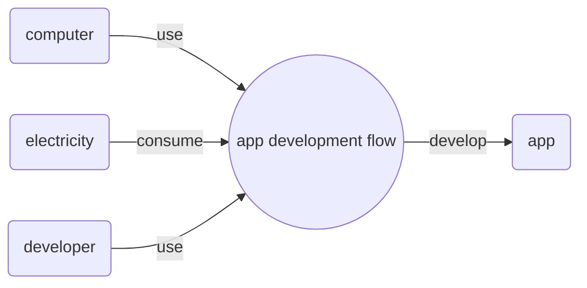
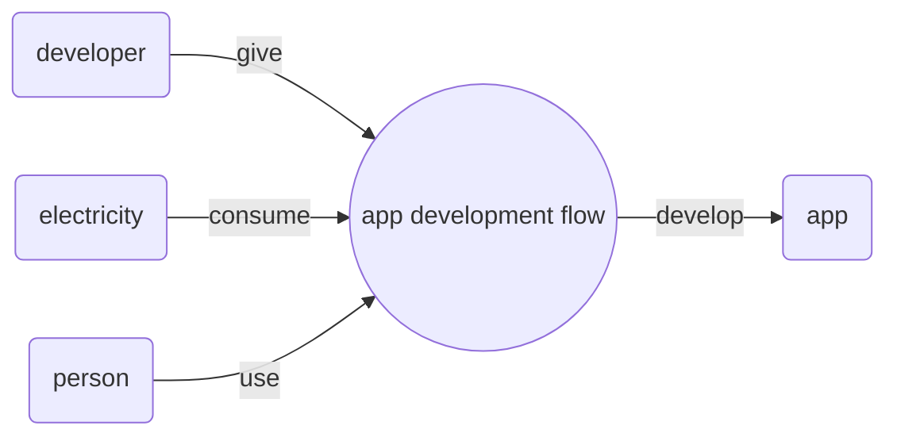

# app development

```mermaid
%% app development flow
graph LR
  i1(computer)-- use -->f
  i3(electricity)-- consume -->f
  i4(developer)-- use -->f
  f((app development flow))-- develop -->o1
  o1(app)
```

```mermaid
%% app exchange flow
graph LR
  i1(developer)-- give -->f
  i3(electricity)-- consume -->f
  i4(person)-- use -->f
  f((app development flow))-- develop -->o1
  o1(app)
```
